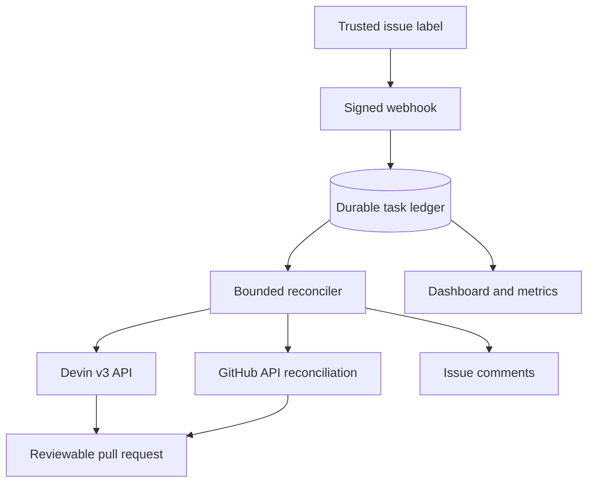

# Devin Remediation Orchestrator

Turn an approved GitHub issue into a governed Devin engineering session, a reviewable pull request,
and measurable delivery signals. Terminal Devin status is reconciled with GitHub, so an existing PR
is authoritative for PR-creation success even when the session later stops for inactivity or budget.

This project uses Apache Superset dependency/test-infrastructure debt as the concrete workflow:

1. remove Superset's `apispec<6.7.0` ceiling by reproducing and fixing the compatibility failure;
2. upgrade Cypress 11 and remove its legacy Chrome 117 headless workaround.

A maintainer applies `devin-remediate` only after reviewing scope. That label is the event and the
approval boundary.

## Executive answer

**Problem:** scanners and backlog tools identify work, but senior engineers still spend time
reproducing dependency failures, navigating unfamiliar code, adapting implementation and tests,
and packaging the result for review.

**System:** a signed GitHub webhook creates one durable, budget-capped Devin v3 session per approved
issue. The service reconciles Devin's session state with the actual GitHub branch/PR state and
exposes progress, PR-creation success, failures, and time-to-PR.

**Why Devin:** a version-bump script works only when the bump works. Devin is the core primitive
because it can execute the non-deterministic engineering loop: inspect the repository, reproduce
the failure, form and test a hypothesis, modify code and tests, recover from failures, and author a
coherent PR. The orchestrator supplies policy and measurement; it does not duplicate Devin's job.

## Architecture



See [docs/ARCHITECTURE.md](docs/ARCHITECTURE.md) for lifecycle, failure handling, security, and the
production scaling path.

## Verified real-world results

| Approved issue | Devin session | Output | Final CI | Time to PR |
| --- | --- | --- | --- | ---: |
| [#1: remove the apispec ceiling](https://github.com/anuragdebGH/superset/issues/1) | [81343bde…](https://app.devin.ai/sessions/81343bde0f4e4524979c0c18fad22795) | [PR #4](https://github.com/anuragdebGH/superset/pull/4) | All checks passed | 48m 55s |
| [#3: upgrade Cypress](https://github.com/anuragdebGH/superset/issues/3) | [5691ac46…](https://app.devin.ai/sessions/5691ac464cf745ebadaa6f6ceec3d272) | [PR #5](https://github.com/anuragdebGH/superset/pull/5) | All checks passed | 7m 32s |

Observed aggregate:

- 2 real GitHub events, 2 real Devin API sessions, and 2 reviewable pull requests;
- 100% PR-creation success, 0 unreconciled failures, and 28m 14s average time-to-PR;
- both remediation PRs have green CI; neither is automatically merged.

The evaluation is intentionally honest. Devin produced both remediation PRs. PR #5 needed reruns
for transient/configuration-related CI failures. PR #4 exposed two pre-existing documentation-build
failures. Those baseline defects were isolated in [issue #6](https://github.com/anuragdebGH/superset/issues/6)
and repaired through [PR #7](https://github.com/anuragdebGH/superset/pull/7), rather than mixing them
into the apispec remediation. The orchestrator initially recorded terminal Devin reasons as failures;
GitHub reconciliation recovered the existing PRs without creating new sessions.

## Credential-free end-to-end simulation

Requirements: Docker with Compose and Python 3.11+.

```bash
ENV_FILE=.env.demo docker compose up --build -d
python scripts/simulate_webhook.py
open http://localhost:8080/dashboard
```

The simulator sends the same HMAC-signed GitHub payload as production. Mock adapters then move the
session through `running` to `completed` and emit a clearly synthetic `/pull/999` URL. This verifies
the event, policy, idempotency, state machine, comments, metrics, and dashboard without external
credentials. It does **not** prove that Devin changed Superset; only a real Devin session and PR do.

Clean up:

```bash
ENV_FILE=.env.demo docker compose down -v
```

## Run against Devin and GitHub

### 1. Verify the prepared Superset issues

The fork and approved backlog items already exist:

- [Issue #1: remove the apispec ceiling](https://github.com/anuragdebGH/superset/issues/1)
- [Issue #3: upgrade Cypress and remove the workaround](https://github.com/anuragdebGH/superset/issues/3)

Authenticate GitHub CLI, then run the read-only verification:

```bash
./scripts/verify_superset_setup.sh
```

For a fresh run, issues should remain unlabelled until the live webhook is ready. The two linked
issues have already been triggered for this verified demonstration. Issue #2 is an intentionally
closed duplicate and is not part of the remediation workflow.

### 2. Connect the repository to Devin

Grant Devin's GitHub integration access to `anuragdebGH/superset` and verify a manual Devin session
can clone the fork, push a branch, and open a PR. The orchestrator's GitHub token is separate and
needs repository metadata/pull-request read plus Issues read/write for reconciliation and comments.

### 3. Configure

```bash
cp .env.example .env
```

Set:

- `GITHUB_WEBHOOK_SECRET`: random shared secret configured on the GitHub webhook;
- `GITHUB_TOKEN`: fine-grained token with Issues read/write on the fork;
- `DEVIN_API_KEY`: Devin v3 service-user key or supported personal access token;
- `DEVIN_ORG_ID`: the target Devin organization ID;
- `DEVIN_MAX_ACU_LIMIT`: hard per-session budget;
- `GITHUB_REPOSITORY`: keep `anuragdebGH/superset` for this project.

Do not commit `.env`.

### 4. Start and expose the webhook

```bash
docker compose up --build -d
curl http://localhost:8080/healthz
```

Expose port 8080 using your approved HTTPS ingress/tunnel. In the fork's **Settings → Webhooks**,
configure:

- payload URL: `https://<host>/webhooks/github`
- content type: `application/json`
- secret: the exact `GITHUB_WEBHOOK_SECRET`
- event: **Issues**

### 5. Trigger and observe

Apply `devin-remediate` to one prepared issue. Then use:

```bash
curl http://localhost:8080/api/tasks
curl http://localhost:8080/api/summary
curl http://localhost:8080/metrics
```

Open `http://localhost:8080/dashboard`. The GitHub issue also receives the Devin session URL and,
on success, the PR URL. A task becomes successful only after a PR is discovered in Devin's response
or by an exact GitHub lookup for `devin/issue-{issue_number}`. The system never merges it.

## Observable outcomes

| Question from engineering leadership | Signal |
| --- | --- |
| Is work moving? | counts by state and active queue on dashboard/metrics |
| Is it producing engineering output? | completed throughput and PR links |
| Is it reliable? | PR-creation success rate, reconciliation logs, and explicit failure reasons |
| Is it getting faster? | average start-to-PR duration |
| Can I audit a run? | issue → task ID → Devin session → branch/PR links |
| Is spend bounded? | maximum concurrency plus Devin per-session ACU ceiling |

## API

| Endpoint | Purpose |
| --- | --- |
| `POST /webhooks/github` | verified GitHub webhook receiver |
| `GET /api/tasks` | recent task state and links |
| `GET /api/summary` | throughput, PR-creation success, active work, time-to-PR |
| `POST /api/tasks/{id}/retry` | explicit retry for failed tasks |
| `GET /metrics` | Prometheus text exposition |
| `GET /dashboard` | technical/leadership control plane |
| `GET /healthz` | liveness check |

## Test

```bash
python -m pip install -e '.[dev]'
ruff check .
pytest -q
docker build -t devin-remediation-orchestrator .
```

The 14 tests cover signature rejection, event policy, trusted-author and repository gates,
duplicate delivery/issue handling, state transitions, prompt guardrails, GitHub status comments,
a full mock session-to-PR lifecycle, terminal-session PR recovery, and one-time historical
reconciliation without repeated GitHub polling.

## Demo assets

- [Five-minute Loom script](docs/LOOM_SCRIPT.md)
- [Architecture and production path](docs/ARCHITECTURE.md)
- [Verification record and submission evidence](docs/VERIFICATION.md)
- [Superset issue 1](docs/issues/01-apispec-upgrade.md)
- [Superset Cypress issue (#3)](docs/issues/02-cypress-upgrade.md)

## Known limits

- The demo deployment uses one process and SQLite; production multi-worker scale needs Postgres and
  a real queue.
- Session status is polled because this implementation does not assume a Devin completion webhook.
- PR-creation success means Devin exposed a PR or GitHub reconciliation found one. It does not mean
  CI is green or the PR was merged; the two current PRs were separately verified green.
- The mock mode proves orchestration behavior only and must never be represented as a real
  remediation result.

## Production extensions

- ingest GitHub check runs so PR creation, CI validation, and merge readiness are separate states;
- replace SQLite and the in-process worker with Postgres and a durable queue for multi-worker scale;
- deploy stable authenticated webhook ingress instead of a temporary development tunnel;
- add exponential backoff, dead-letter handling, alerts, and service-level objectives;
- track Devin configuration/version and per-task cost alongside latency and outcome metrics.

## API references

- [Devin API overview](https://docs.devin.ai/api-reference/overview)
- [Devin v3 OpenAPI specification](https://docs.devin.ai/v3-openapi.yaml)
- [Devin prompting guidance](https://docs.devin.ai/essential-guidelines/instructing-devin-effectively)
- [GitHub webhook signature validation](https://docs.github.com/en/webhooks/using-webhooks/validating-webhook-deliveries)
