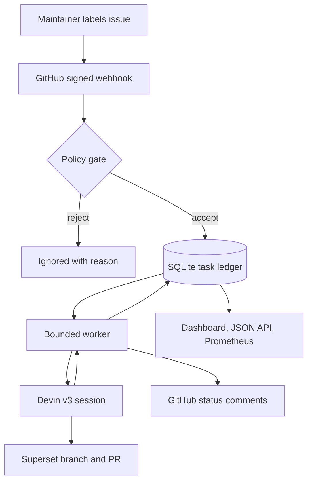

# Architecture and operating model

## System boundary

The orchestrator is a control plane, not a second coding agent. It decides **whether**, **when**,
and **under what guardrails** an approved issue becomes a Devin session. Devin owns the adaptive
engineering loop: repository exploration, reproduction, implementation, tests, git operations,
and pull-request authoring.

## Lifecycle

| State | Meaning | Leader signal |
| --- | --- | --- |
| `queued` | Event accepted and durably recorded | Backlog/throughput gap |
| `starting` | Worker owns session creation | Short transition; stale state is actionable |
| `running` | Devin is actively working | Session URL on the issue/dashboard |
| `action_required` | Devin awaits input or approval | Human intervention required |
| `completed` | Devin finished and a PR was observed | PR URL and time-to-PR |
| `failed` | API/session failed or finished without a PR | Error, issue comment, retry endpoint |

## Correctness and safety decisions

- **At-least-once delivery, idempotent effect:** GitHub can redeliver webhooks. A unique delivery ID
  plus a unique repository/issue key prevents duplicate sessions.
- **Durable reconciliation:** The webhook does not wait for Devin. SQLite WAL records the work;
  the worker repeatedly reconciles sessions with recorded IDs after restarts. If a process dies in
  the narrow interval between the remote create and local ID write, the task fails closed as an
  uncertain external outcome; an operator inspects Devin before explicitly retrying.
- **Bounded autonomy:** `MAX_CONCURRENT_SESSIONS` and `DEVIN_MAX_ACU_LIMIT` cap operational and
  spend exposure.
- **Least privilege:** the orchestrator GitHub token only needs issue-comment access. Devin's
  separately governed GitHub integration owns branches and PRs.
- **No autonomous merge:** the prompt forbids merge. Output is a reviewable PR, not production
  mutation.
- **Prompt-injection boundary:** only maintainer-associated issues in one allowlisted repository
  can run. Issue text is explicitly delimited as untrusted data, and secret/workflow/permission
  changes are excluded.
- **Fail closed:** invalid signatures, wrong repositories, untrusted authors, malformed events,
  and missing live credentials never create a session.

## Production extensions

SQLite and an in-process worker are deliberate for a five-minute demonstrator. At higher scale:

1. Replace SQLite with Postgres and use `SELECT ... FOR UPDATE SKIP LOCKED` for multi-worker claims.
2. Put webhook events on SQS/Pub/Sub with a dead-letter queue and explicit retry policy.
3. Export OpenTelemetry traces and route Prometheus metrics to Grafana.
4. Add repository-specific playbooks, test commands, risk tiers, and approval policies.
5. Consume CI/check-run results before declaring success; auto-close only low-risk, green PRs.
6. Add session-insights and ACU-consumption endpoints for cost per accepted PR and ROI reporting.
